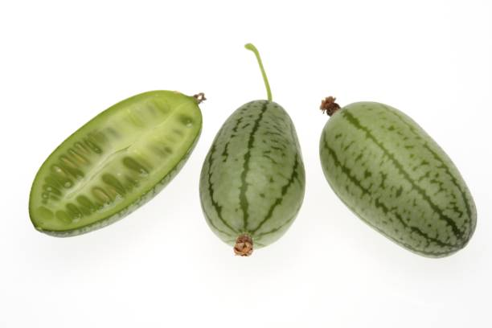
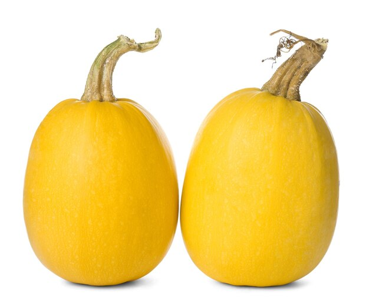
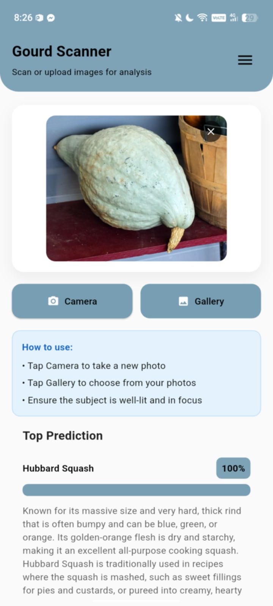
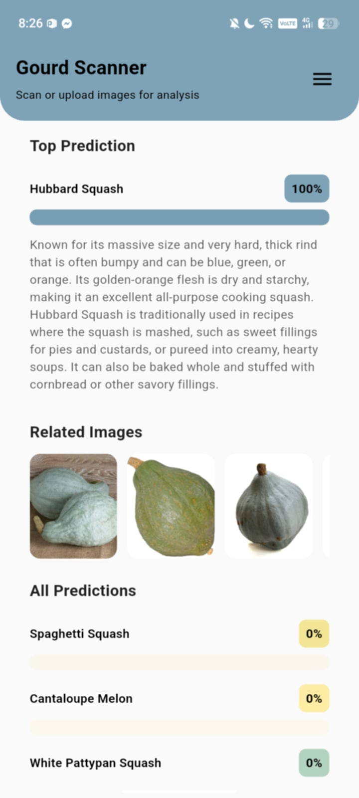
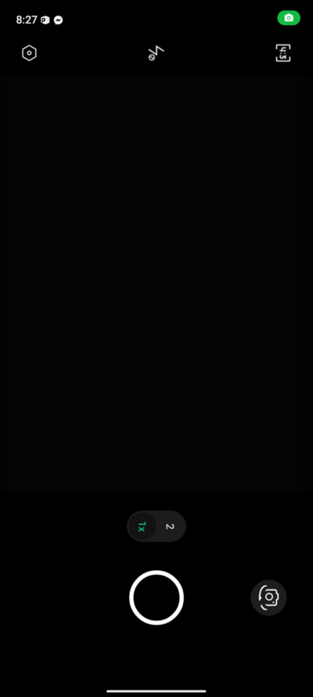
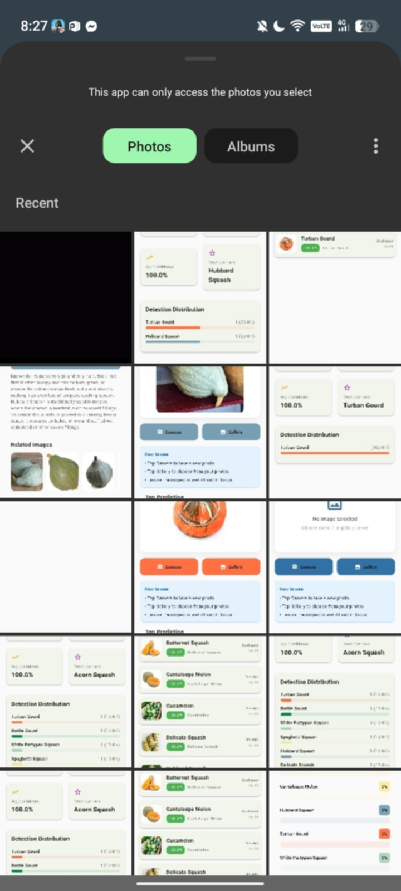
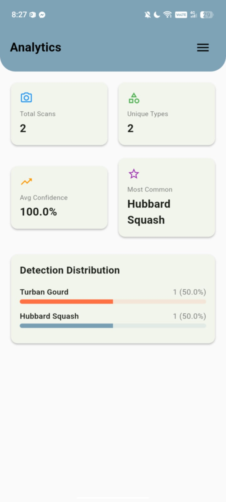

  

##  Hi, I’m Zylcee 👋

I’m an **Information Technology student** at **Caraga State University – Cabadbaran Campus** who enjoys learning how websites and systems work from the ground up.  
I like turning ideas into simple, functional, and user-friendly projects while improving my design and coding skills.

I’m especially interested in **web development**, **mobile development**, and building projects that simulate real-world use.

---

## 🎓 About Me

- 🎓 BS Information Technology student  
- 🏫 Caraga State University – Cabadbaran Campus  
- 💻 Interested in web and mobile development  
- 🎨 Enjoy learning UI/UX and layout design  
- 🏐 Loves playing volleyball  
- 🎧 Music helps me stay focused while coding  

---

## 📌 Notable Projects

- **Personal Portfolio Website**  
  A simple web portfolio showcasing my skills and projects using HTML, CSS, and JavaScript.

- **Centralized Online Marketplace (Concept Project)**  
  A system concept involving users, sellers, admin management, and basic system flow.

- **Java-Based System Projects**  
  Academic projects focused on logic, structure, and system functionality.

- **Flutter Practice Apps**  
  Beginner mobile apps created to explore Flutter and Dart.

---

## 🎯 Current Focus

- Improving frontend design and page layouts  
- Writing cleaner and more organized code  
- Gaining confidence in presenting and documenting projects  
- Exploring mobile development using Flutter  

---

## 🛠️ Technologies I Use

### 🌐 Web Development

### 🧠 Programming Languages

### 📱 Mobile Development

### ⚙️ Tools & Environment

---

## 📈 GitHub Stats

⭐ *This profile will continue to grow as I learn, build, and improve.*

## 📌 Featured Project: Gourd Scanner (Flutter App)

### 📖 About This Repository

This repository represents **one specific project** inside my GitHub account and serves as the **final project** for my Information Technology coursework.

The **README.md** explains what the project is about, how it is organized, and what features the application provides. Inside this repository, you will find folders for source code, screenshots, image classes, and supporting files. This structure reflects how GitHub repositories are typically organized for real-world projects.

---

## 🌱 Current Project: Gourd Scanner

**Gourd Scanner** is a mobile application developed using **Flutter**. It is an **image-based gourd and squash classification app** that helps users identify different types of gourds and squashes using a trained image recognition model.

The app allows users to:

* 📷 Capture an image using the camera
* 🖼 Upload an existing image from the gallery

After scanning, the app displays:

* The predicted gourd/squash class
* Confidence percentage of the prediction
* Scan analytics
* A history of previous scans

This project helped me practice Flutter UI development, basic machine learning integration, image handling, and organizing features into a clean and user-friendly mobile interface.

---

## 🎃 Gourd & Squash Classes Overview

Below is an overview of the **gourd and squash classes** that Gourd Scanner can recognize. Each row includes the class name, a short description, and a sample image from the `Gourd_class` folder.

<table>
<tr>
<th>Class Name</th>
<th>Description</th>
<th>Sample Image</th>
</tr>
<tr>
<td><b>Acorn Squash</b></td>
<td>A small, green squash with a ribbed exterior and mildly sweet flesh.</td>
<td align="center"></td>
</tr>
<tr>
<td><b>Bottle Gourd</b></td>
<td>A long, light-green gourd commonly used in soups and vegetable dishes.</td>
<td align="center"></td>
</tr>
<tr>
<td><b>Butternut Squash</b></td>
<td>A pear-shaped squash with smooth skin and sweet, orange flesh.</td>
<td align="center"></td>
</tr>
<tr>
<td><b>Cantaloupe Gourd</b></td>
<td>A round gourd known for its netted skin and sweet interior.</td>
<td align="center"></td>
</tr>
<tr>
<td><b>Cucamelon Gourd</b></td>
<td>A small gourd resembling a miniature watermelon, often used decoratively.</td>
<td align="center"></td>
</tr>
<tr>
<td><b>Delicata Squash</b></td>
<td>An oblong squash with cream-colored skin and green stripes.</td>
<td align="center"></td>
</tr>
<tr>
<td><b>Hubbard Squash</b></td>
<td>A large squash with thick skin and rich, flavorful flesh.</td>
<td align="center"></td>
</tr>
<tr>
<td><b>Spaghetti Squash</b></td>
<td>A squash that separates into spaghetti-like strands when cooked.</td>
<td align="center"></td>
</tr>
<tr>
<td><b>Turban Gourd</b></td>
<td>A decorative gourd with a distinctive turban-shaped top.</td>
<td align="center"></td>
</tr>
<tr>
<td><b>White Pattypan Squash</b></td>
<td>A small, flat squash with scalloped edges and pale skin.</td>
<td align="center"></td>
</tr>
</table>

---

## 📱 Application Screenshots

### 🏠 Main Page & Scan Results

<table>
<tr>
<td align="center">
<b>Main Page</b>  
  
The Main Page serves as the entry point of the app, allowing users to access the camera, gallery upload, analytics, and scan history.
</td>
<td align="center">
<b>Scan Result (Camera)</b>  
  
Displays the classification result after capturing an image using the camera, including the predicted class and confidence score.
</td>
<td align="center">
<b>Scan Result (Gallery)</b>  
  
Shows the classification output after selecting an image from the gallery.
</td>
</tr>
</table>

---

## 📷 Capture, Upload & 📜 History

<table width="100%">
<tr>
<td width="60%" align="center">
<b>Camera & Gallery</b>  

  
Users can capture new images using the camera or upload existing photos from the gallery for gourd classification.
</td>
<td width="40%" align="center">
<b>Scan History</b>  
  
The History screen stores previous scan results, allowing users to review detected classes and confidence values.
</td>
</tr>
</table>

---

## 📊 Analytics

<table width="100%">
<tr>
<td align="center">
<b>Analytics Overview</b>  
  
This screen visualizes scan statistics, showing how often each gourd or squash class has been detected.
</td>
</tr>
</table>

---

## 🚀 Key Features Summary

| Feature                    | Description                                                                                              |
| -------------------------- | -------------------------------------------------------------------------------------------------------- |
| Image Capture & Upload     | Users can take a photo using the camera or upload an existing image from the gallery for classification. |
| Gourd & Squash Recognition | The app predicts the gourd or squash type based on the trained image classification model.               |
| Confidence-Based Results   | Each scan displays a confidence percentage to indicate prediction reliability.                           |
| Usage Analytics            | Analytics provide insights into scan frequency and detected classes.                                     |
| Scan History               | Previous scans are stored with their results for easy review.                                            |

---

⭐ *Gourd Scanner demonstrates my progress in Flutter development, UI design, and applied machine learning concepts through a practical mobile application.*
